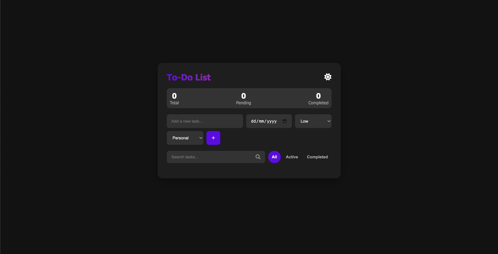
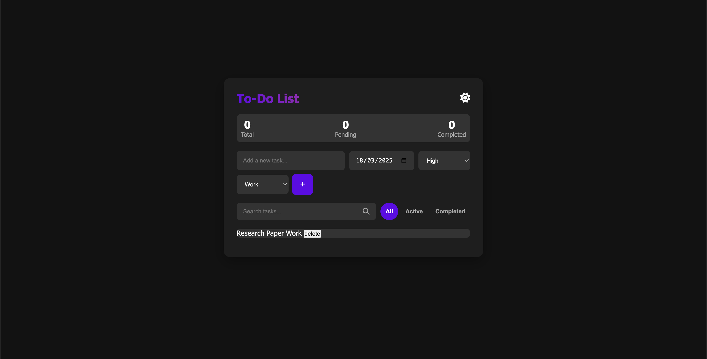

# TaskMaster: Advanced Todo Application

<p align="center">
  
  
</p>


## Overview
TaskMaster is a feature-rich task management application built with HTML, CSS, and vanilla JavaScript. It's designed to help users organize their tasks efficiently with a clean, intuitive interface and powerful features typically found in premium task management tools.

## Key Features

### Task Management
- **Create Tasks**: Add new tasks with customizable properties
- **Edit Tasks**: Modify existing tasks through a convenient modal interface
- **Delete Tasks**: Remove tasks with a smooth fade-out animation
- **Complete Tasks**: Mark tasks as done with a checkbox toggle

### Task Properties
- **Due Dates**: Set and track deadlines for each task
- **Priority Levels**: Assign high, medium, or low priority to tasks
- **Categories**: Organize tasks by personal, work, or other categories

### Organization & Filtering
- **Drag and Drop**: Reorder tasks with intuitive drag-and-drop functionality
- **Filters**: Toggle between all, active, and completed tasks
- **Search**: Find specific tasks quickly with real-time search functionality

### Visual Cues & Accessibility
- **Priority Indicators**: Color-coded flags for different priority levels
- **Due Date Warnings**: Visual indicators for overdue tasks and tasks due today
- **Category Tags**: Easily identify tasks by category with tag indicators

### User Experience
- **Empty State**: Friendly message when no tasks are available
- **Statistics**: Track total, pending, and completed task counts
- **Dark/Light Mode**: Toggle between themes for different lighting conditions

### Data Persistence
- **Local Storage**: Tasks are saved locally, persisting across browser sessions

## Technical Implementation

### State Management
The application uses a simple but effective state management system:
```javascript
// State variables
let tasks = JSON.parse(localStorage.getItem("tasks")) || [];
let currentFilter = "all";
let currentEditTaskId = null;
let draggedItem = null;
```

### Task Structure
Each task is represented as a JavaScript object with properties:
```javascript
const newTask = {
  id: Date.now(),
  text: taskText,
  completed: false,
  dueDate: dueDateInput.value,
  priority: prioritySelect.value,
  category: categorySelect.value,
  createdAt: new Date().toISOString()
};
```

### Task Rendering
Tasks are rendered with a semantic HTML structure and include visual cues for priority and due dates:
```javascript
li.innerHTML = `
  <div class="task-content">
    <div class="task-left">
      <input type="checkbox" class="task-checkbox" ${task.completed ? 'checked' : ''}>
      <div class="task-details">
        <div class="task-text">${task.text}</div>
        <div class="task-meta">
          <div class="task-category" data-category="${task.category}">
            <i class="fas fa-tag"></i> ${task.category}
          </div>
          <div class="task-priority" data-priority="${task.priority}">
            <i class="fas fa-flag"></i> ${task.priority}
          </div>
          <div class="task-due-date ${dueDateClass}">
            <i class="fas fa-calendar"></i> ${formattedDate}
          </div>
        </div>
      </div>
    </div>
    <div class="task-actions">
      <button class="task-action-btn edit-btn" title="Edit Task">
        <i class="fas fa-edit"></i>
      </button>
      <button class="task-action-btn delete-btn" title="Delete Task">
        <i class="fas fa-trash"></i>
      </button>
    </div>
  </div>
`;
```

### Drag and Drop Implementation
The application includes a custom drag and drop implementation:
```javascript
function getDragAfterElement(container, y) {
  const draggableElements = [...container.querySelectorAll('li:not(.dragging)')];
  
  return draggableElements.reduce((closest, child) => {
    const box = child.getBoundingClientRect();
    const offset = y - box.top - box.height / 2;
    
    if (offset < 0 && offset > closest.offset) {
      return { offset: offset, element: child };
    } else {
      return closest;
    }
  }, { offset: Number.NEGATIVE_INFINITY }).element;
}
```


## Setup and Usage

### Requirements
- Modern web browser (Chrome, Firefox, Safari, Edge)
- Internet connection for Font Awesome icons

### Installation
1. Download the project files
2. Open `index.html` in your web browser

### Getting Started
1. Enter a task description in the input field
2. Select a due date, priority, and category
3. Click "Add Task" or press Enter
4. Use the filters to view different task sets
5. Search for specific tasks with the search bar
6. Toggle between dark and light mode with the theme button

## Conclusion
TaskMaster demonstrates how powerful web applications can be created using only HTML, CSS, and vanilla JavaScript. With its intuitive UI, robust feature set, and thoughtful design, it provides a productive task management experience while serving as an excellent example of modern front-end development practices.


## Future Works
1. I am currently implementing the defined features one by one, while simultaneously testing and refining them to enhance functionality and ensure a more efficient and user-friendly experience.
2. Improving the UI/UX of the website and making it more apealing.
3. Increasing the number of features present in the website and fully using all the CRUD functionalities.
4. Subtasks and nested task support
